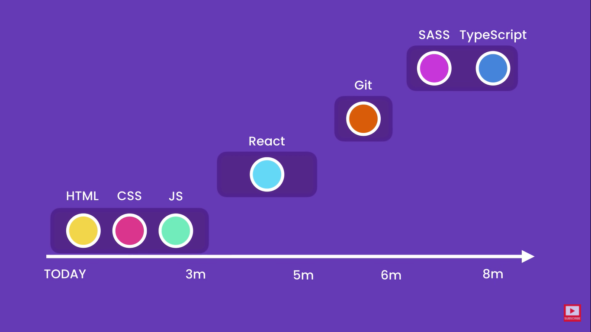

# Fullstack Resources for 2021

Here is the resource I've been following for fullstack developemnt.  
may this helps anybody who are confused to pick the right resource.

 

# 0. Design Fundamentals :

|                        Book                        |         Author          |                                            Download                                            |
| :------------------------------------------------: | :---------------------: | :--------------------------------------------------------------------------------------------: |
|                      Learnux                       |       Learnux.io        |                                  [View](https://learnux.io/)                                   |
|                 Design Principles                  |    principles.design    |                               [View](https://principles.design/)                               |
|                     Laws of UX                     |        lawsofux         |                                 [View](https://lawsofux.com/)                                  |
|        The design of Everyday things (pdf)         |       Don Norman        | [Downlaod](https://drive.google.com/file/d/1ivjumCIZ2JnxrhYytSrNB-TrMbKXTCYh/view?usp=sharing) |
|            Web UI best Practices (pdf)             |         UX pin          | [Downlaod](https://drive.google.com/file/d/1GC3YlyAblpQ3mWad0qgfERLCNt1rFdKy/view?usp=sharing) |
|             Don't make me think (pdf)              |       Steve Krug        | [Downlaod](https://drive.google.com/file/d/1mXMrQqlgIjvAX7Gmu97K2EYvJ4Oh3tz_/view?usp=sharing) |
|                    Hooked (pdf)                    |  Nir Eyal, Ryan Hoover  | [Downlaod](https://drive.google.com/file/d/1mXMrQqlgIjvAX7Gmu97K2EYvJ4Oh3tz_/view?usp=sharing) |
| The Essential Guide to User Interface Design (pdf) |    Wilbert O. Galitz    | [Downlaod](https://drive.google.com/file/d/1M90uTrzOjATXF0nybxVVUHQ2MpnbVeh4/view?usp=sharing) |
|              Thinking with type (pdf)              |    Wilbert O. Galitz    | [Downlaod](https://drive.google.com/file/d/1ttcgzvkZLoI1hsk22mbXIoH6fjYJ3Xvy/view?usp=sharing) |
|                 Grid System (pdf)                  | Mueller Brockmann Josef | [Downlaod](https://drive.google.com/file/d/1ttcgzvkZLoI1hsk22mbXIoH6fjYJ3Xvy/view?usp=sharing) |
|             Steal Like an Artist (pdf)             |      Austin Kleon       | [Downlaod](https://drive.google.com/file/d/1ttcgzvkZLoI1hsk22mbXIoH6fjYJ3Xvy/view?usp=sharing) |

 

# 1. HTML and CSS :

|             Book              |      Author      |                                             Download                                             |
| :---------------------------: | :--------------: | :----------------------------------------------------------------------------------------------: |
|          HTML & CSS           |   Jon Duckett    |  [Downlaod](https://drive.google.com/file/d/1byqBxIWGjQ-bHepkTJKA9vAptlOJVM09/view?usp=sharing)  |
|          HTML & CSS           | Niederst Robbins |  [Downlaod](https://drive.google.com/file/d/1bChzGvK-wpdPQK4NVL0RT8K5xoNnHBPv/view?usp=sharing)  |
|          HTML & CSS           |  mosh hamedani   |                               [View](https://youtu.be/qz0aGYrrlhU)                               |
|     Complete CSS - Udemy      |    Acade Mind    | [Download](https://drive.google.com/drive/folders/1n0Z-zv_3ZLNci4azvmB_bKPXc8rjv7Qc?usp=sharing) |
| Curated list of CSS Resources |   alligator.io   |                         [View](https://alligator.io/css/css-resources/)                          |

 

# 2. JavaScript and JQuery :

|           Book            |       Author        |                                            Download                                            |
| :-----------------------: | :-----------------: | :--------------------------------------------------------------------------------------------: |
| Eloquent_JavaScript (pdf) |  Marijn Haverbeke   | [Downlaod](https://drive.google.com/file/d/1f5WkhkBe17Wmm-FMpdeUwxmwby2Z8vFe/view?usp=sharing) |
|    Speaking JavaScript    | Dr Alex Rauschmayer | [Downlaod](https://drive.google.com/file/d/1BjO3Fdzc_0RKBLkDHYiF6HQkqje_WcDD/view?usp=sharing) |
|   JavaScript and JQuery   |     Jon Duckett     | [Downlaod](https://drive.google.com/file/d/1GkXpYvkgywPxREfNFF7orZPhiZn_3efz/view?usp=sharing) |

 

# 3. Vue and React :

|             Book             |                   Author                    |                                            Download                                            |
| :--------------------------: | :-----------------------------------------: | :--------------------------------------------------------------------------------------------: |
|   Vue.js 3 Cookbook (pdf)    |            Heitor Ramon Ribeiro             | [Downlaod](https://drive.google.com/file/d/1VeNJqpTAu2B2xmW5VZ4LNZpfZMhJSeI6/view?usp=sharing) |
| Vue js-Up-and-Running (pdf)  |                Callum Macrae                | [Downlaod](https://drive.google.com/file/d/1pG82nW6Nrh7w0Kh27AkGVo6_uxmv86sv/view?usp=sharing) |
|     FullStack Vue (pdf)      | Hassan Djirdeh, Nate Murray, and Ari Lerner | [Downlaod](https://drive.google.com/file/d/1ogdjR_To8XZwEA1zAQbcR_4yXEPf4pad/view?usp=sharing) |
| How to code in React.Js(pdf) |          Joe morgan Digital Ocean           | [Downlaod](https://drive.google.com/file/d/1K8bRW3xuiS8Z-lqcrL7pcqRjhbnyzPRD/view?usp=sharing) |
|   The road to react (pdf)    |                Robin Wieruch                | [Downlaod](https://drive.google.com/file/d/1E9TXaWuan3TiPN76qWgTsTTqsSI6xC0U/view?usp=sharing) |

 

# 4. Node and Express :

|                 Book                  |          Author          |                                            Download                                            |
| :-----------------------------------: | :----------------------: | :--------------------------------------------------------------------------------------------: |
| Web Development with Node and Express |       Ethan Brown        | [Downlaod](https://drive.google.com/file/d/1q2KdP35koGHFv27G0UPFzJsTBf-eAoJD/view?usp=sharing) |
|          Node.js in Practice          | ALEX YOUNG & MARC HARTER | [Downlaod](https://drive.google.com/file/d/1I6dE6TyEeO89hafc4GiMhoGCSt8VOvL2/view?usp=sharing) |

 

## Everyday 3-4 hrs and 8 months see yourself as a fullstack developer.

